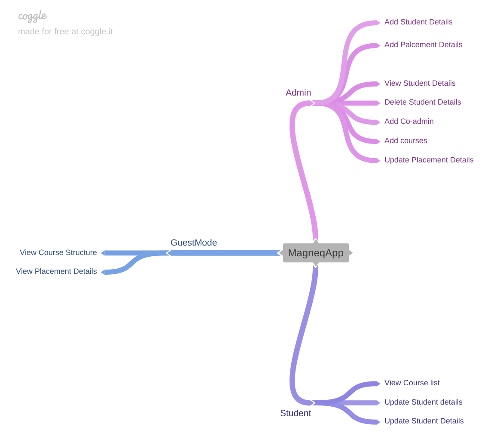

# MagneqApp
## College Automation System Devloped using .NET FRAMEWORK AND SQL SERVER
## Build with
* C#
* ADO.NET
* MICROSOFT SQL SERVER

## Screenshots
## <h5>Over All Workflow</h5>
 
 
 
 
 
 
 
